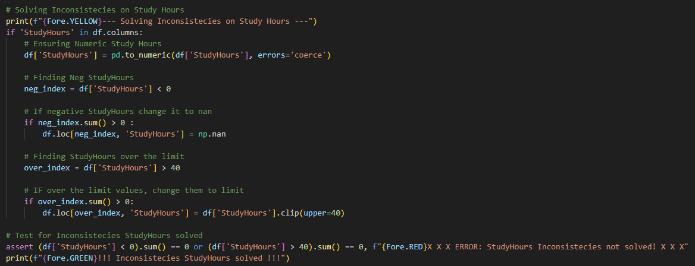
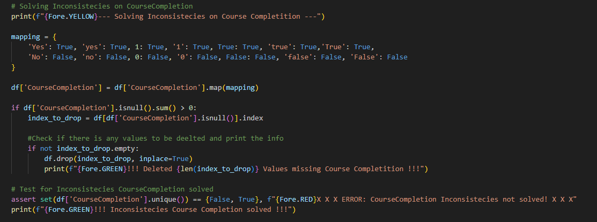
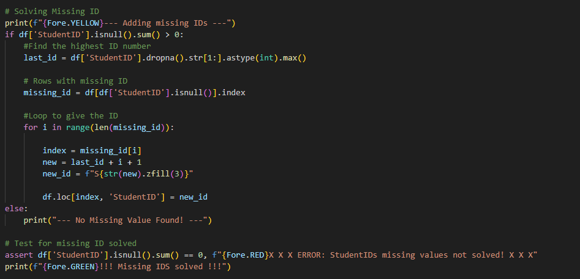
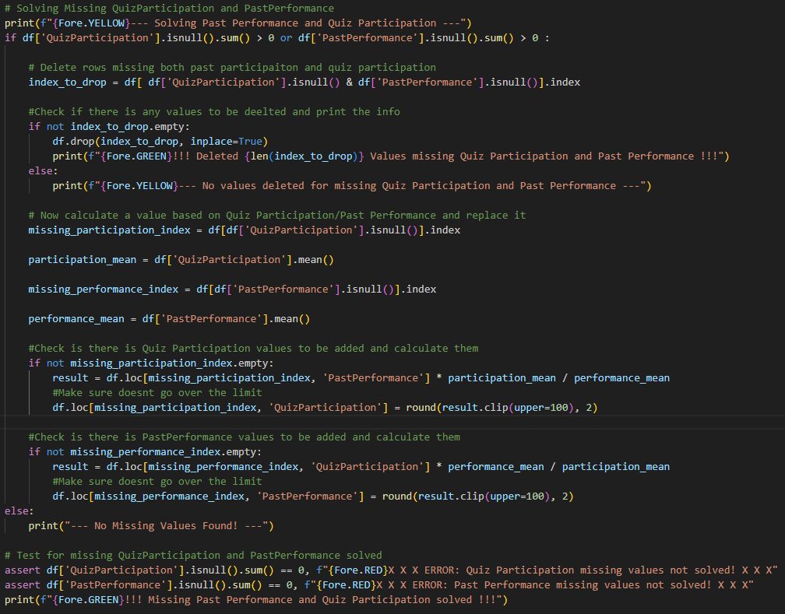

# Introduction

This report is developed as part of the Continuous Assessment for Programming for Artificial Intelligence (PGDAI_SEP25), it oulines the design, implementation and analyse of a python program that simulates the analyses of student behaviors. The implementation of the project was divided into four main stages:

1. Data Generation: Task to create a CSV file (students_raw.csv) with 500 rows and noise.

2. Data Wrangling: Task to clean and transforms the raw data, creating a clean CSV file (students_clean.csv).

3. Data Analysis: Task to perform analysis by filtering and grouping the data, as well using functional programming.

4. Data Visualisation: Task to creates plots on PNG format.

This report focus on the Reflection and reporting part, where is descreptive show the processes strategies used to design the solution not forgoting the challenges and lessons learned during execution.

## Libraries used

- NUmpy
- pandas
- seaborn
- matplotlib.pyplot
- colorama
- time


# Project Structure

```
CA/
│
├── main.py               <-- Orchestrator
│
├── script/               <-- Package
│   ├── __init__.py       <-- Makes 'script' a Python package
│   ├── student_data.py   <-- Part 1: Data Generation
│   ├── analysis.py       <-- Part 2: Data Wrangling
│   ├── part_3.py         <-- Part 3: Data Analysis
│   ├── visualisation.py  <-- Part 4: Data Visualisation
│   └── util.py           <-- Utility functions (load/save, etc.)
│
├── (generated files)
│   ├── students_raw.csv
│   ├── students_clean.csv
│   └── ... (plots as .png)
```

The project was designed to emphasize its simplicity, without overengineering, while also promoting principles like reusability, in addition to considering a user-friendly experience. With that in mind, a procedural/functional structure was chosen; however, instead of demanding for a user to run multiple Python scripts, a central orchestrator (main.py) was added to the system design. This orchestrator script abstracts the entire worflow on a single pipeline, ensuring that all functions and scripts run in the right sequece of exucation, from data/file creation through to plotting in PNG, furthermore it includes robust concepts like ```try/catch``` blocks to terminate the program gracefully in case of an interruption. This main orchestrator can be accessed by:

```
python main.py
```

In order to secure the project's proper reliability, a dedicated Python package housing all core modules for the implementation of the solution was designed. This package, by the name "scripts," contained the core modules, the ```__init__.py``` empty file (as required by Python packaging conventions) and also a ```util.py``` module. This Utilities module embodies the functions that were otherwise repeated multiple times across the core modules, such as initiating colorama and reading or saving files. In addition, it aligns with the DRY (Don't Repeat Yourself) principle, which states, "Every piece of knowledge must have a single, unambiguous, authoritative representation within a system." [1]

Following the designed architecture, there are the core modules that cover each stage of the CA implementation. These modules were organized by multiple private functions and a ```main()``` function that abstracts the execution of the module by coordinating each “step function”. At the very bottom of the module is the name-main idiom (```if __name__ == "__main__":```) to avoid the main() function being run when the module is imported. Moreover, the “Step Functions” were made private (prefixed by an underscore), thereby respecting the principle of encapsulation. The modules also include multiple ```print()``` statements to inform the user about the stages and ```asserts``` statements to make sure that the script is running smoothly. 


# Data Generation

# Data Wrangling

The second phase of the implementation consists of loading the raw CSV file created in the previous phase and fixing it using multiple cleaning and wrangling strategies, like dropping rows or filling the missing values with new, imputed, or calculated values. This phase also involves validating the ranges of values to guarantee that none of them would go above the limit, normalizing the study hours to fall between 0 and 1, and, finally, creating a new derived column for engagement.

The data wrangling script solves the inconsistencies first, as some invalid values will be set as NaN and be processed by the missing values function after. Specifically, to solve inconsistencies in study hours, past performance, and quiz participation, the logic was the same and simple: in case of a negative value, it would be replaced with NaN, as it's hard to infer the reason for the negative value and its intended value. Conversely, for entries over the established upper limits (100 for past performance and quiz participation and 40 h for study hours), it would be assumed that the inconsistency might have happened due to some bonus points or extra work, so the most logical solution is to clip and set to their respective limits.



A distinct logic was the one applied to solve the course completion column inconsistencies. Accounting for a potential scenario where the dataframe is provenient from a merge of different or legacy systems, it was anticipated that the field might contain a range of values, from the traditional (0, 1) to strings (yes, no, true, false) and also Bool values. With that in mind, the logic to fix these inconsistencies was to simply map a dictionary with all plausible variations to either True or False.



Continuing on the script, it moves to the missing-value handling function. Firstly, the function solves the missing IDs, and as the IDs must remain unique, the best solution developed was to get the last available ID, increment it, and fill in the missing rows, rather than deleting or leaving them blank. Needless to say, this logic is only justifiable for data analysis and should not be implemented into a production environment.



The most elaborate solution was implemented for the missing quiz participation and past performance. First, there is an if statement that checks if the row is missing both past performance and quiz performance; in that case, the row is dropped. If only one is missing, a smart calculation is used: the function computes the mean of the differences between quiz participation and past performance for the whole group, then uses that average value to estimate the missing value. This method is based on the premise that the student performance follows the class average trend (e.g., if the course difficulty changes, the student would move along with the class). This approach, of course, has its limitations, but it provides a better solution than simply inserting the overall mean value.




The strategies you used for handling missing and inconsistent values.
The main findings from your analysis.
The insights drawn from your visualisations.
Challenges you faced, how you resolved them, and what you learned.

# Reflection

several challenges were reaised during the creating of this project, and solved with creativity and knowledge, showing how important this caracteristics are for the scientsts and their academic/working life